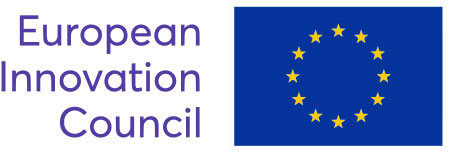

# Objective

FUTURE supports Ephos in establishing the world’s most advanced femtosecond laser writing facility for the production of quantum photonic chips. 

# About Ephos

Ephos is building the essential infrastructure for quantum technologies. Leveraging our proprietary femtosecond laser writing manufacturing process, we design and build glass-based photonic quantum chips controlling every aspect of the process, from materials procurement through benchmarking. 

# About FUTURE

FUTURE is an EIC Transition 2023 project funded by the European Innovation Council under the European Union's Horizon Europe Framework Programme for Research and Innovation (grant agreement No 101136471).

